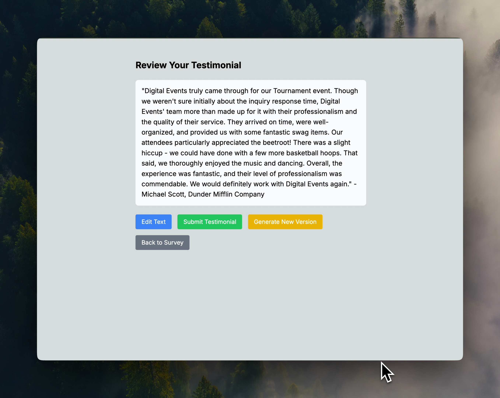

# Event Survey & Testimonial Generator

A modern, customizable Next.js application for collecting event feedback and automatically generating AI-powered testimonials.



## Features

- 📝 Comprehensive event feedback form with multiple sections:
  - Basic Information
  - Pre-Event Communication
  - Event Day Feedback
  - Overall Satisfaction
  - Future Collaboration
  - Written Testimonial
- 🤖 AI-powered testimonial generation using GPT-4
- ✏️ Testimonial review and editing interface
- 🔄 Multiple testimonial regeneration options
- 🌐 Webhook integration for data collection
- 📱 Responsive design with Tailwind CSS
- ✨ Type-safe with TypeScript and Zod validation
- 🎯 Customizable satisfaction ratings and yes/no responses

## Tech Stack

- Next.js 14
- TypeScript
- Tailwind CSS
- OpenAI GPT-4
- React
- Zod

## Setup

1. Clone the repository

```bash
git clone https://github.com/yourusername/event-survey-generator.git
cd event-survey-generator
```

2. Install dependencies

```bash
npm install
```

3. Create a `.env` file with the following variables:

```plaintext
OPENAI_API_KEY=your_openai_api_key
NEXT_PUBLIC_COMPANY_NAME=Your Company Name
WEBHOOK_URL=your_webhook_url
```

4. Run the development server

```bash
npm run dev
```

## Configuration

### Environment Variables

- `OPENAI_API_KEY`: Your OpenAI API key for testimonial generation
- `NEXT_PUBLIC_COMPANY_NAME`: Your company name (displayed in the UI)
- `WEBHOOK_URL`: URL where survey data will be sent (e.g., Zapier webhook)

### Survey Sections

1. Basic Information

   - Name
   - Company
   - Event Date
   - Event Type

2. Pre-Event Communication

   - Inquiry Response Time
   - Phone Experience
   - Quote Time

3. Event Day Feedback

   - Arrival Time
   - Setup
   - Staff Performance
   - Event Flow
   - Product Quality

4. Overall Satisfaction

   - Event Services
   - Communication
   - Professionalism
   - Service Quality

5. Future Collaboration

   - Booking Interest
   - Improvement Suggestions

6. Written Testimonial
   - Custom Testimonial
   - Consent for Sharing

### Rating Options

- Satisfaction: Satisfied, Neutral, Dissatisfied
- Yes/No Questions
- Free-form Text Fields
- Event Type Selection

## Project Structure

```
src/
├── app/
│   ├── api/
│   │   ├── generate-testimonial/
│   │   └── submit-survey/
│   ├── layout.tsx
│   └── page.tsx
├── components/
│   ├── survey-form/
│   ├── testimonial-review/
│   └── success-message/
├── config/
│   └── constants.ts
└── lib/
    └── types.ts
```

## Type Definitions

The application includes comprehensive TypeScript definitions for:

- Survey Data Structure
- Event Types
- Satisfaction Ratings
- Basic Info Validation
- Form Error Handling

## Contributing

1. Fork the repository
2. Create your feature branch (`git checkout -b feature/amazing-feature`)
3. Commit your changes (`git commit -m 'Add some amazing feature'`)
4. Push to the branch (`git push origin feature/amazing-feature`)
5. Open a Pull Request

## License

MIT

## Acknowledgments

- [Next.js](https://nextjs.org/)
- [OpenAI](https://openai.com/)
- [Tailwind CSS](https://tailwindcss.com/)
- [Zod](https://github.com/colinhacks/zod)
